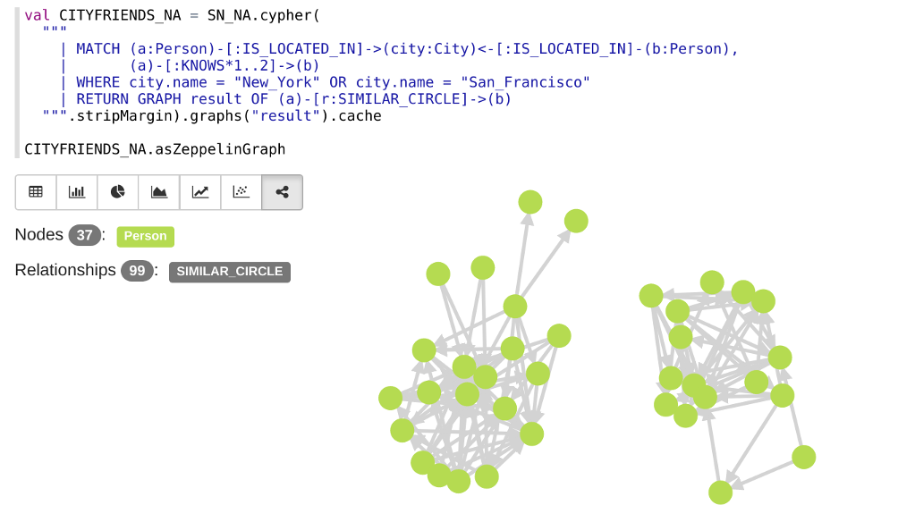

# CAPS: Cypher for Apache Spark

CAPS extends [Apache Spark™](https://spark.apache.org) with [Cypher](https://neo4j.com/docs/developer-manual/current/cypher/), the industry's most widely used [property graph](https://github.com/opencypher/openCypher/blob/master/docs/property-graph-model.adoc) query language defined and maintained by the [openCypher](http://www.opencypher.org) project.
It allows for the **integration** of many **data sources** and supports **multiple graph** querying.
It enables you to use your Spark cluster to run **analytical graph queries**.
Queries can also return graphs to create **processing pipelines**.

Below you see a screenshot of running a Cypher query with CAPS running in a [Zeppelin notebook](https://github.com/opencypher/cypher-for-apache-spark/wiki/Use-CAPS-in-a-Zeppelin-notebook):


## Intended audience

CAPS allows you to develop complex processing pipelines orchestrated by a powerful and expressive high-level language.
In addition to **developers** and **big data integration specialists**, CAPS is also of practical use to **data scientists**, offering tools allowing for disparate data sources to be integrated into a single graph. From this graph, queries can extract subgraphs of interest into new result graphs, which can be conveniently exported for further processing.

In addition to traditional analytical techniques, the graph data model offers the opportunity to use Cypher and *[Neo4j graph algorithms](https://neo4j.com/blog/efficient-graph-algorithms-neo4j/)* to derive deeper insights from your data.
<!-- TODO: WIKI How does it relate to GraphX and GraphFrames -->
<!--- **Data Analysts**: -->
<!--  This example shows how to aggregate detailed sales data within a graph — in effect, performing a ‘roll-up’ — in order to obtain a high-level summarized view of the data, stored and returned in another graph, as well as returning an even higher-level view as an executive report. The summarized graph may be used to draw further high-level reports, but may also be used to undertake ‘drill-down’ actions by probing into the graph to extract more detailed information.-->

## Current status: Alpha

The project is currently in an alpha stage, which means that the code and the functionality are still changing. We haven't yet tested the system with large data sources and in many scenarios. We invite you to try it and welcome any feedback.

## CAPS Features

CAPS is built on top of the Spark DataFrames API and uses features such as the Catalyst optimizer.
The Spark representations are accessible and can be converted to representations that integrate with other Spark libraries.

CAPS supports a subset of Cypher <!-- TODO: WIKI supported features --> and is the first implementation of [multiple graphs](https://github.com/boggle/openCypher/blob/CIP2017-06-18-multiple-graphs/cip/1.accepted/CIP2017-06-18-multiple-graphs.adoc) and graph query compositionality.

CAPS currently supports importing graphs from both Neo4j and from custom [CSV format](https://github.com/opencypher/cypher-for-apache-spark/tree/master/src/test/resources/csv/sn) in HDFS.
CAPS has a data source API that allows you to plug in custom data importers for external sources.

## CAPS Roadmap

CAPS is under rapid development and we are planning to:
- Support more Cypher features
- Make it easier to use by offering it as a Spark package and by integrating it into a notebook
- Provide additional integration APIs for interacting with existing Spark libraries such as GraphX

## Get started with CAPS
CAPS is currently easiest to use with Scala. Below we explain how you can import a simple graph and run a Cypher query on it.

### Building CAPS

CAPS is built using Maven

```
mvn clean install
```

<!--
#### Add the CAPS dependency to your project
In order to use CAPS add the following dependency to Maven:
<!-- TODO: Publish to Maven Central -- >
```
<dependency>
  <groupId>org.opencypher.caps</groupId>
  <artifactId>caps_2.11</artifactId>
  <version>0.1.0-NIGHTLY</version>
</dependency>
```
-->

### Hello CAPS

Cypher is based on the [property graph](https://github.com/opencypher/openCypher/blob/master/docs/property-graph-model.adoc) model, comprising labelled nodes and typed relationships, with a relationship either connecting two nodes, or forming a self-loop on a single node. 
Both nodes and relationships are uniquely identified by an ID of type `Long`, and contain a set of properties. 

The following example shows how to convert a friendship graph represented as Scala case classes to a `CAPSGraph` representation. 
The `CAPSGraph` representation is constructed from node and relationship scans.
The scan construction describes to `CAPSGraph` how this graph structure is read from a `DataFrame`.  

Once the graph is constructed the `CAPSGraph` instance supports Cypher queries with its `cypher` method.

```scala
import org.opencypher.caps.api.record._
import org.opencypher.caps.api.spark.{CAPSGraph, CAPSSession}

case class Person(id: Long, name: String) extends Node

case class Friend(id: Long, source: Long, target: Long, since: String) extends Relationship

object Example extends App {
  // Node and relationship data
  val persons = List(Person(0, "Alice"), Person(1, "Bob"), Person(2, "Carol"))
  val friendships = List(Friend(0, 0, 1, "23/01/1987"), Friend(1, 1, 2, "12/12/2009"))

  // Create CAPS session
  implicit val caps = CAPSSession.local()

  // Create graph from nodes and relationships
  val graph = CAPSGraph.create(persons, friendships)

  // Query graph with Cypher
  val results = graph.cypher(
    """| MATCH (a:Person)-[r:FRIEND]->(b)
       | RETURN a.name AS person, b.name AS friendsWith, r.since AS since""".stripMargin
  )

  case class ResultSchema(person: String, friendsWith: String, since: String)

  // Print result rows mapped to a case class
  results.as[ResultSchema].foreach(println)
```

The above program prints:
```
ResultSchema(Alice,Bob,23/01/1987)
ResultSchema(Bob,Carol,12/12/2009)
```


#### Next steps

- How to use CAPS in [Apache Zeppelin](https://github.com/opencypher/cypher-for-apache-spark/wiki/Use-CAPS-in-a-Zeppelin-notebook)
- Look at and contribute to the [Wiki](https://github.com/opencypher/cypher-for-apache-spark/wiki)
<!-- TODO: Multiple graphs example -->
<!-- TODO: Steps needed to run the demo with toy data -->
<!-- TODO: WIKI article that demonstrates a more realistic use case with HDFS data source -->
<!-- TODO: WIKI link to page that explains how to import data -->

## How to contribute

We'd love to find out about any issues you encounter. We welcome code contributions -- please open an [issue](https://github.com/opencypher/cypher-for-apache-spark/issues) first to ensure there is no duplication of effort. <!-- TODO: Determine CLA and process -->

## License

The project is licensed under the Apache Software License, Version 2.0

## Copyright

© Copyright 2016-2017 Neo4j, Inc.

Apache Spark™, Spark, and Apache are registered trademarks of the [Apache Software Foundation](https://www.apache.org/).
